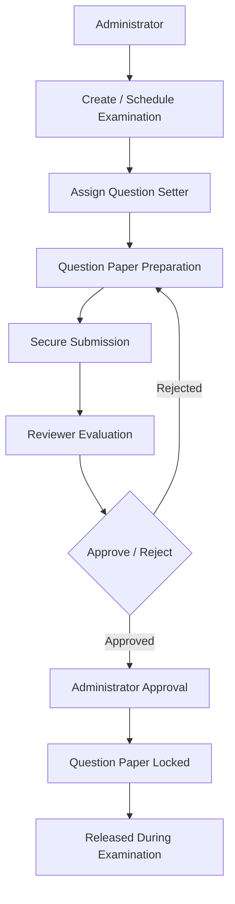

# 🎓 Secure Examination Workflow & Question Paper Management System

**A secure, role-based platform for managing the complete examination lifecycle — from scheduling to controlled release.**

---

## 📖 Overview

Traditional examination processes often rely on manual workflows that can lead to unauthorized access, last-minute changes, and inconsistencies in question paper preparation.

This project provides a **centralized digital platform** that simplifies and secures the examination workflow, supporting:

- Secure question paper preparation and management
- Role-based access and authorization
- Structured question paper review and approval
- Outcome-Based Education (OBE) requirements
- Detailed audit tracking of examination activities
- Controlled and time-based question paper release

The application manages the complete examination lifecycle — from exam scheduling and question paper preparation to review, approval, and controlled release — while maintaining **confidentiality, integrity, and accountability** at every stage.

> **Note on stack naming:** The project was originally scoped as a PERN-style (PostgreSQL/Express/React/Node) application. The current implementation uses **MongoDB** as the database.

---

## ✨ Key Features

### 📝 Examination Setup & Management
- Create and schedule examinations
- Configure examination patterns and settings
- Set examination date, duration, and total marks
- Lock examination details once finalized

### 📄 Question Paper Preparation
- Create question papers based on the approved syllabus
- Organize questions into different sections
- Assign marks to individual questions
- Automatically validate total marks
- Associate each question with **Unit Number**, **Course Outcome (CO1–CO4)**, and **Difficulty Level**

### ✅ Review & Approval
- Dedicated reviewer access
- Read-only question paper review
- Approve submitted question papers
- Reject papers with review comments
- Request necessary revisions

### 🔐 Security
- Role-Based Access Control (RBAC)
- JWT-based authentication
- Secure password hashing
- Encrypted question paper storage
- Time-restricted access
- Comprehensive audit logging
- Question paper locking after submission
- Controlled release during examination

---

## 🔄 System Workflow



---

## 🎯 Course Outcome (CO) Mapping

Each question is mapped to a Course Outcome to support Outcome-Based Education (OBE) requirements:

| Course Outcome | Description |
|---|---|
| **CO1** | Remember and Understand |
| **CO2** | Apply Concepts |
| **CO3** | Analyze and Solve Problems |
| **CO4** | Design, Evaluate and Think Critically |

Questions are also tagged with a **Unit Number** and **Difficulty Level** during preparation.

---

## 🔒 Security

The system is built with security as a core requirement across the entire examination workflow:

- **Role-Based Access Control (RBAC)** — restricts actions based on user role
- **JWT-based Authentication** — secure, stateless session handling
- **Secure Password Hashing** — via bcrypt
- **Encrypted Question Paper Storage** — using the Node.js Crypto module
- **Time-Restricted Access** — limits access to sensitive stages
- **Comprehensive Audit Logging** — tracks examination-related activity
- **Question Paper Locking** — papers are locked after submission to prevent tampering
- **Controlled Release** — question papers are released only during the scheduled examination window

---

## 🛠️ Technology Stack

<details open>
<summary><strong>Frontend</strong></summary>

| Technology | Purpose |
|---|---|
| React.js | UI library |
| React Router | Client-side routing |
| JavaScript | Core scripting language |
| CSS | Styling |
| Axios | HTTP client for API requests |

</details>

<details open>
<summary><strong>Backend</strong></summary>

| Technology | Purpose |
|---|---|
| Node.js | Runtime environment |
| Express.js | Web application framework |
| JWT Authentication | Secure authentication |
| bcrypt | Password hashing |
| Crypto Module | Question paper encryption |

</details>

<details open>
<summary><strong>AI Service</strong></summary>

| Technology | Purpose |
|---|---|
| FastAPI | AI service API framework |
| Ollama | Local LLM runtime |
| Llama 3.2 | Language model |

> The AI Service runs as a **separate microservice** alongside the main Node.js/Express backend — it does not replace it.

</details>

<details open>
<summary><strong>Database</strong></summary>

| Technology | Purpose |
|---|---|
| MongoDB | Primary data store |

</details>

---

## 🏗️ Architecture

The system follows a multi-service architecture:

```
┌─────────────────┐       ┌──────────────────────┐       ┌─────────────────┐
│   React.js       │ <-->  │  Node.js / Express.js │ <-->  │    MongoDB       │
│   (Frontend)      │       │   (Backend API)       │       │   (Database)     │
└─────────────────┘       └──────────────────────┘       └─────────────────┘
                                      │
                                      ▼
                           ┌──────────────────────┐
                           │  FastAPI + Ollama      │
                           │  (Llama 3.2 AI Service)│
                           └──────────────────────┘
```

- The **React.js frontend** communicates with the backend via **Axios**.
- The **Node.js/Express backend** handles authentication, RBAC, examination workflow logic, and MongoDB data access.
- The **AI Service** (FastAPI + Ollama + Llama 3.2) operates as an independent service used alongside the core backend.

---

## 🚀 Future Enhancements

> The following features are **planned** and are **not yet implemented**.

- [ ] Two-Factor Authentication (2FA)
- [ ] Digital Signature Verification
- [ ] Email Notifications
- [ ] Real-time Workflow Tracking
- [ ] Bloom's Taxonomy Mapping
- [ ] Automatic CO Analytics
- [ ] PDF Encryption
- [ ] Cloud Deployment
- [ ] Multi-University Support

---

## 👥 Contributors

This project was developed as part of the academic curriculum.

---

## 📄 License

<!-- No license information was provided. Add a license (e.g., MIT, Apache-2.0) here if applicable. -->s the password for the corresponding username.
